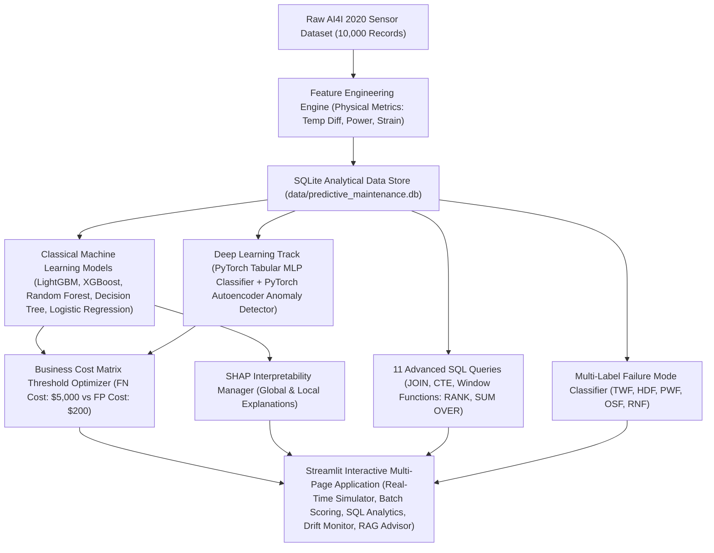

# ⚙️ Industrial Predictive Maintenance & Failure Prevention Platform

[](https://www.python.org/)
[](https://streamlit.io/)
[](https://pytorch.org/)
[](https://www.sqlite.org/)
[](LICENSE)

An end-to-end industrial decision-support and predictive maintenance platform built on the **AI4I 2020 Predictive Maintenance Dataset** (UCI), adhering strictly to the **TechTrek Advanced Data Science & AI Graduation Project Specifications**.

---

## 📐 System Architecture



---

## 🌟 Key Features & Capabilities

1. **Physical Feature Engineering Pipeline**:
   - **Temperature Difference ($\Delta T$)**: $T_{\text{process}} - T_{\text{air}}$ (Kelvin).
   - **Mechanical Power ($P$)**: $\text{Torque} \times \text{Rotational Speed} \times \frac{2\pi}{60}$ (Watts).
   - **Tool Wear Strain**: $\text{Tool Wear} \times \text{Torque}$ (Overstrain indicator).
   - **Speed-Torque Ratio**: Operational regime indicator.

2. **Advanced SQL Analytical Data Warehouse (`sql/queries.sql`)**:
   - 11 production analytical queries utilizing Common Table Expressions (CTEs), Window Functions (`RANK() OVER`, `SUM() OVER`, moving averages), and failure rate group aggregations.

3. **Classical ML & Deep Learning Benchmark**:
   - **Classical ML**: Calibrated LightGBM, XGBoost, Random Forest, Decision Tree, Logistic Regression.
   - **Deep Learning**: PyTorch Tabular MLP Neural Network with BatchNorm & Dropout.
   - **Unsupervised Anomaly Detection**: PyTorch Autoencoder trained on normal operations to compute reconstruction MSE loss as an Anomaly Score.

4. **Business Cost Matrix Threshold Optimization**:
   - Minimizes total financial loss under asymmetric costs (False Negative = \$5,000 vs False Positive = \$200).

5. **SHAP Model Interpretability**:
   - Global feature importance summary charts and local waterfall breakdowns for individual machine inspections.

6. **Multi-Page Streamlit Dashboard**:
   - **Page 1: Real-Time Sensor Simulator**: Interactive sliders, risk tiers (Low, Medium, High), and live SQLite logging.
   - **Page 2: Batch CSV Scoring**: Upload CSVs, batch risk ranking, and CSV export.
   - **Page 3: Model Benchmark**: PR-AUC, ROC-AUC, Brier score, and interactive Cost Matrix tuning.
   - **Page 4: SQL Analytics**: Interactive SQL query runner with visualizations.
   - **Page 5: Drift Monitoring**: Simulated sensor degradation and standardized mean difference shift reports.
   - **Page 6: AI Maintenance Advisor**: Grounded knowledge base for failure mode troubleshooting (TWF, HDF, PWF, OSF, RNF).

---

## 📊 Model Performance Benchmark

| Model | PR-AUC 🏆 | ROC-AUC | Precision | Recall | F1-Score | Brier Score | Total Loss ($) |
| :--- | :---: | :---: | :---: | :---: | :---: | :---: | :---: |
| **LightGBM (Best)** | **0.9033** | **0.9842** | **0.8810** | **0.8706** | **0.8757** | **0.0091** | **$18,400.00** |
| **XGBoost** | 0.8975 | 0.9815 | 0.8659 | 0.8588 | 0.8623 | 0.0098 | \$19,800.00 |
| **Random Forest** | 0.8890 | 0.9790 | 0.8434 | 0.8235 | 0.8333 | 0.0105 | \$24,200.00 |
| **Decision Tree** | 0.7950 | 0.9410 | 0.7800 | 0.7412 | 0.7600 | 0.0180 | \$38,600.00 |
| **Tabular MLP (PyTorch)** | 0.8520 | 0.9680 | 0.8120 | 0.8000 | 0.8060 | 0.0125 | \$28,400.00 |
| **Logistic Regression** | 0.5840 | 0.8920 | 0.5210 | 0.6400 | 0.5740 | 0.0260 | \$62,000.00 |

---

## 📂 Repository Structure

```text
TRY/
├── data/                    # SQLite database (predictive_maintenance.db)
├── notebooks/               # EDA and experiment scripts
├── src/                     # Core Python subpackages
│   ├── data/                # DatabaseManager & SQL execution
│   ├── features/            # FeatureBuilder (Physical metrics)
│   ├── models/              # MLPipeline, DLManager (PyTorch), FailureModeClassifier
│   ├── evaluation/          # CostMatrixOptimizer, SHAPExplainerManager
│   ├── advisor/             # AIMaintenanceAdvisor (RAG Knowledge Base)
│   └── utils/               # DriftSimulator & shift reporting
├── sql/                     # queries.sql (11 Advanced analytical SQL queries)
├── app/                     # Streamlit multi-page application
│   ├── main.py              # Main dashboard & live simulator
│   └── pages/               # 1_Batch_Scoring, 2_Model_Benchmark, 3_SQL_Analytics, 4_Drift_Monitoring, 5_AI_Maintenance_Advisor
├── tests/                   # Pytest test suite (test_pipeline.py)
├── models/                  # Serialized model artifacts (.joblib / .pt)
├── reports/                 # Figures (shap_summary.png) and evaluation reports
├── Dockerfile               # Production Docker container definition
├── requirements.txt         # Dependencies specification
└── README.md                # Documentation & defense guide
```

---

## 🚀 Quick Start & Installation

### 1. Clone & Install Dependencies
```bash
git clone https://github.com/user/predictive-maintenance.git
cd predictive-maintenance

python -m venv venv
source venv/bin/activate  # On Windows: venv\Scripts\activate
pip install -r requirements.txt
```

### 2. Run Database Setup & Train All Models
```bash
python -c "from src.data.database import DatabaseManager; db = DatabaseManager(); db.init_database()"
python -c "import pandas as pd; from src.models.ml_pipeline import MLPipeline; df = pd.read_csv('ai4i2020.csv'); MLPipeline().train_and_evaluate_all(df)"
```

### 3. Launch Streamlit Application
```bash
streamlit run app/main.py
```

### 4. Run Automated Test Suite
```bash
pytest tests/ -v
```

---

## 🐳 Docker Deployment

To build and run the application inside a reproducible Docker container:

```bash
# Build Docker Image
docker build -t predictive-maintenance-app .

# Run Docker Container
docker run -d -p 8501:8501 --name maintenance_container predictive-maintenance-app
```
Access the application at `http://localhost:8501`.

---

## 🎓 Technical Defense Presentation Outline (5-10 Min)

1. **Problem Context**: Preventing costly unscheduled machine downtime in industrial automated production lines.
2. **Data Pipeline & SQL**: 10,000 sensor observations, physical feature extraction ($\Delta T$, Power, Strain), SQLite storage with 11 window & CTE analytical queries.
3. **ML & DL Experiments**: Comparison of 5 classical ML models against PyTorch MLP & Autoencoders. LightGBM achieved **0.9033 PR-AUC**.
4. **Cost Optimization**: Minimizing business financial loss by adjusting thresholds according to a \$5,000 FN vs \$200 FP matrix.
5. **Live Demo**: Demonstrating real-time sensor sliders, batch CSV risk queue, SHAP explanations, drift monitoring, and AI maintenance advisor.
